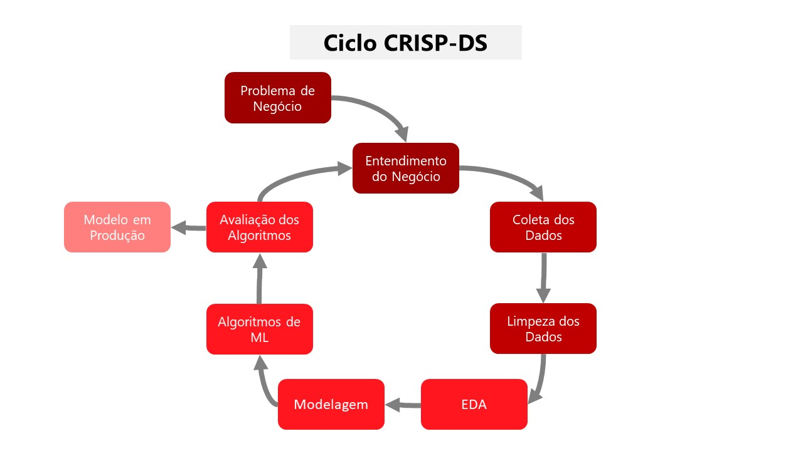

# Detecção de fraudes em transações bancárias *(Work In Progress)*

# 1. Questão de negócio
A **Alura Data Solutions** (empresa fictícia) é uma startup de consultoria que desenvolve soluções de dados para outras empresas.

A startup trabalha com diversos projetos em ciência de dados e busca diversificar seus clientes, inclusive, trazer soluções para negócios que passam por situações de fraude, por exemplo, bancos ou comércios que enfrentam esse tipo de problema.

Para atrair clientes que precisam resolver situações de fraude, o time de Ciência de Dados teve a ideia de desenvolver um [Pipeline](https://acervolima.com/o-que-e-pipeline-de-ciencia-de-dados/) de solução para este tipo de problema para ficar disponível no portfólio da startup.

## 1.1 Desafio

Como Cientista de Dados, o meu objetivo é responder a seguinte pergunta:

1. **Como diminuir as fraudes nas transações de um banco?**

# 2. Premissas de negócio

# 3. Planejamento da solução
## 3.1 Entendimento do negócio:

- **Como diminuir as fraudes nas transações de um banco?**
    - **Qual é a motivação?**  
    A startup Alura Data Solutions busca atrair e diversificar mais os seus clientes, então, surgiu a necessidade de ter no porfólio da consultoria uma solução contra fraudes.

    - **Qual é a causa raiz do problema?**  
    Demonstrar expertise da startup, para este tipo de problema, para um mercado novo

    - **Quem é o dono do problema?**  
   Sócio da Startup

    - **Qual é o formato da solução?**  
    **Granularidade**: Score de propensão à fraude por cada transação 
    **Tipo de problema**: Modelo de propensão  
    **Potenciais métodos**: Algoritmos de Classificação  
    **Produto final**:  TBD, planilha csv com score de cada transação

## 3.2 Processo
### 3.2.1 Estratégia da solução
A metodologia utilizada para resolver este problema é a [CRISP-DS](https://blog.magrathealabs.com/crisp-ds-cyclic-methodology-for-data-science-projects-10c7d00fbc85), o objetivo é entregar valor o mais rápido possível para o negócio e melhorar continuamente a solução. A estratégia é detalhada no plano a seguir:

 
 **1 DESCRIÇÃO DOS DADOS**
- Coleta dos dados <local da coleta>
- Entendimento do significado de cada atributo da base de dados
- Renomeação das colunas, entendimento da dimensão e tipo dos dados
- Tratamento de dados nulos
- Análise dos atributos através de estatística descritiva

 **2 FEATURE ENGINEERING**
- Criação de mapa mental de hipóteses do negócio
- Criação de novas features necessárias para a validação das hipóteses

**3 FILTRAGEM DOS DADOS**
- Filtragem dos registros e atributos de acordo com as restrições do negócio

**4 ANÁLISE EXPLORATÓRIA DE DADOS (EDA)**
- Análise univariada para avaliação dos detalhes de cada atributo, incluse a variável target
- Análise bivariada para validação das hipótestes criadas e geração de insights para o negócio
- Identificação da relevância estimada dos atributos para o aprendizado dos modelos

**5 PREPARAÇÃO DOS DADOS (DATAPREP)**
- Padronização dos atributos numéricos com distribuição normal
- Rescaling dos atributos numéricos com distribuição não normal
- Transformação dos atributos categóricos em atributos numéricos
- Aplicação das transformações realizadas nos dados de teste

**6 FEATURE SELECTION**
- Separaração dos dados em treino e validação
- Aplicação de algoritmo de árvores para obter a sugestão dos atributos mais importantes
- Análise do resultado em conjunto com os atributos relevantes estimados na EDA
- Seleção dos melhores atributos para treinar os modelos de machine learning

**7 MODELOS DE MACHINE LEARNING**
- Aplicação dos algoritmos de classficação: <algoritmos utilizados>
- Validação cruzadada dos algoritmos
- Mensuração de performance dos modelos
- Comparação das métricas entre os modelos aplicados
- Escolha do algoritmo

**8 OTIMIZAÇÃO DOS HIPERPARÂMETROS** 
- <detalhar>

**9 PERFORMANCE DO MODELO NO NEGÓCIO**
- Respostas das questões de negócio
- Comparação dos resultados do (baseline) com o resultado do modelo escolhido
- Tradução da performance do modelo em resultados financeiros

**10 DEPLOYMENT DO MODELO**
- <detalhar>

## 3.3 Ferramentas
Quais ferramentas serão utilizadas no processo?
- Python, Numpy, Pandas, Matplotlib, Seaborn
- Anaconda, VSCode, Jupyter Notebook
- Git, GitHub
- Algoritmos de Classificação
- Excel

## 3.4 Dataset
Será trabalhado com um Storytelling de um banco que conta com um sistema de cadastro dos clientes e aconteceram alguns casos de fraude. Esses dados são públicos e se encontram [Kaggle](https://www.kaggle.com/datasets/gopalmahadevan/fraud-detection-example).

| Variável | Definição |
| --- | --- |
| step  | Unidade do tempo (1 hour) |
| type  | CASH-IN, CASH-OUT, DEBIT, PAYMENT and TRANSFER |
| amount | Valor da transação pela moeda local |
| nameOrig  | Origem da transação |
| oldbalanceOrg | Balanço inicial (antes da transação) |
| newbalanceOrig | Novo balanço (após a transação) |
| nameDest | Destino da transação |
| oldbalanceDest  | Balanço inicial (antes da transação) |
| newbalanceDest | Novo balanço (após a transação) |
| isFraud  | O fraudador assume o controle das contas dos clientes e tenta esvaziá-las transferindo para outra conta e depois sacando |
| isFlaggedFraud | Tentativa ilegal de transferência de uma quantia muito alta em uma única transação |

# 4. Mapa mental de hipóteses
<imagem mapa mental de hipóteses>

Na etapa de EDA, foram gerados alguns insights ao time de negócio através da validação das hipóteses levantadas.

## 4.1 Top 3 insights do negócio
1. **<Hn>**
**FALSA** 
Insight: 

<imagem do gráfico que valida ou invalida hipótese>

# 5. Aplicação dos algoritmos de Machine Learning e métricas

Na etapa de Machine Learning, foram utilizados <quantidade algoritmos> algoritmos <tipo do algoritmo> diferentes: <nome dos algortimos>. Para avaliação do modelo <método de avaliação da performance dos modelos>.

* **<nome do modelo>**

* **<comparação dos modelos>** 

| Model Name | métrica 1 | métrica-n |
| --- | --- | --- |
|  |  |  | 
|  |  |  | 
|  |  |  | 
|  |  |  | 

<interpretração das métricas>

<melhores algoritmos>

<escolha do algoritmo>

<aplicação da otimização dos hiperparâmetros>

<novo resultado do modelo>

# 6. Resultados do negócio
Definido o modelo, é possível responder as questões de negócio, criar alguns cenários e estimar o benefício de seguir a solução proposta por esse projeto.

* <premissas para cálculo do benefício>

## **<cenários>**:

<conclusão>

# 7. <como o modelo foi colocado em produção>

## <nome do método>

# 8. Próximos passos
Este foi o primeiro ciclo do método CRISP-DS para o problema da <nome do problema>, foi possível passar por todas as etapas de um projeto completo de Ciência de Dados e entregar valor ao negócio. 

* O que pode ser feito no próximo ciclo?
    -
- <listar o que será feito no próximo ciclo>

# 9. Referências

- Este projeto é um desafio da [Alura](https://cursos.alura.com.br/course/modelos-preditivos-dados-deteccao-fraude).
- O conjunto de dados foi coletado no [Kaggle](https://www.kaggle.com/datasets/gopalmahadevan/fraud-detection-example).

